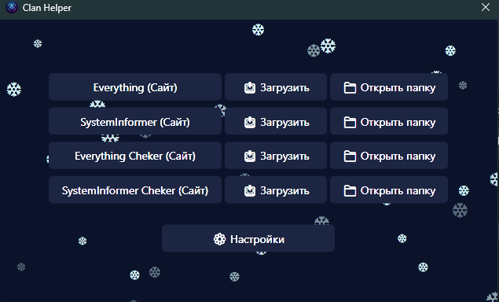
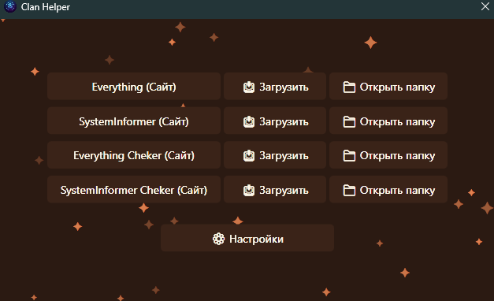
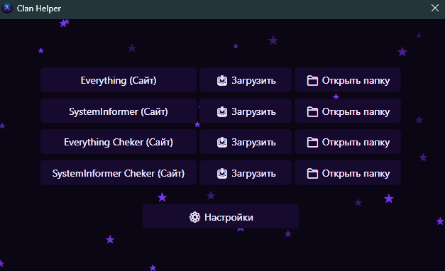
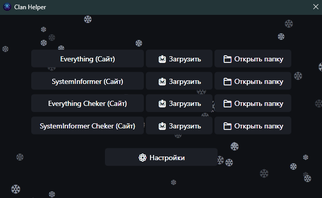
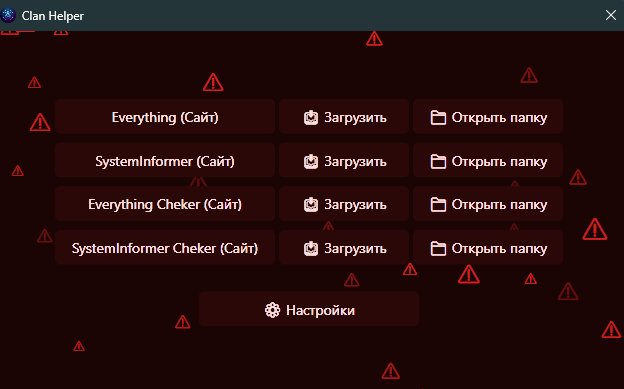
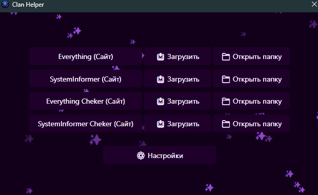
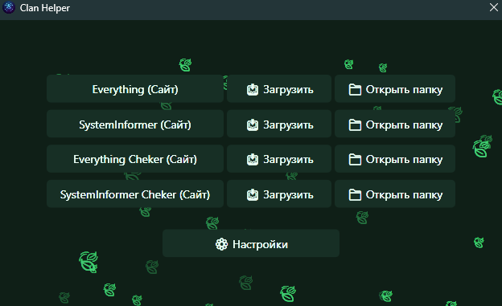
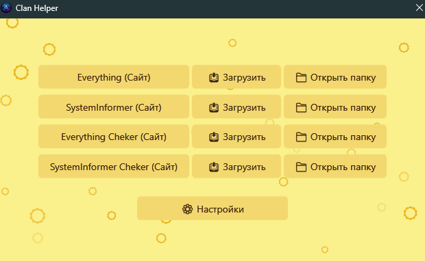

# 🛡️ Clan Helper

**Clan Helper** is a convenient portable utility (WPF / .NET 8) designed for quick access and downloading of tools frequently used for clan checks (Everything, SystemInformer, and custom checkers). 

The application is compiled into a single standalone `.exe` file, allowing it to be run instantly without installing any additional components or runtimes.

---

## ✨ Key Features

- **▶️ Direct Launch:** Run your downloaded tools instantly with a single click directly from the app.
- **📥 Smart Downloads:** Download necessary utilities (`.exe` files) to any folder. Features a real-time progress bar and smart duplicate protection (warns you if the file is already downloaded and offers to launch it instead).
- **📁 Precise Navigation:** Clicking "Open folder" doesn't just open the directory—it automatically highlights the specific downloaded `.exe` file in Windows Explorer.
- **💾 Auto-Save Configuration:** The app remembers your chosen theme, animation state, and download paths between sessions (saved locally in your Documents folder).
- **🌐 Access to Official Sites:** Quick links to the developers' official web pages or the latest GitHub releases.
- **🎨 Advanced UI Customization:** - **8 built-in color themes** with smooth, cinematic fade-in/fade-out transitions.
  - **Custom Title Bar** that seamlessly blends with your active theme.
  - **Dynamic animations:** Background particles (snowflakes, stars, etc.), typewriter text effects, and pulsing highlights.
  - **Focus Mode:** A sleek dim overlay automatically darkens the background when the settings panel is opened.
- **⚡ Eco Mode (For Low-End PCs):** Unchecking "Enable animations" instantly disables all background particles, text typing, and transitions, ensuring zero resource drain on weaker computers.

---

## 🚀 How to Use

1. Download the latest version of `ClanHelper.exe` from the **[Releases](../../releases/latest)** section.
2. Run the executable file (no installation required).
3. Choose the required tool from the list.
4. Click **"📥 Download"**, select a folder on your PC, and wait for the download progress to complete.
5. Click **"▶ Launch"** to run the tool immediately, or **"📁 Open folder"** to locate the file on your drive.

---

## 🎨 Themes Showcase

Here is a preview of the available built-in themes you can switch between in the settings:

| Default Dark Blue | Orange | Midnight Purple | Ice Gray |
| :---: | :---: | :---: | :---: |
|  |  |  |  |

| Red Alert | Purple Neon | Forest | Solar Light |
| :---: | :---: | :---: | :---: |
|  |  |  |  |

---

## 🛠️ For Developers (Build it yourself)

This project is written in C# using the WPF framework.

**Requirements:**
- .NET 8.0 SDK

**Building a single-file executable:**
To compile the project into a single standalone `.exe` file (which includes all necessary `.dll` libraries inside), open the terminal in the project folder and run the following command:

```bash
dotnet publish -c Release -r win-x64 --self-contained true -p:PublishSingleFile=true -p:IncludeNativeLibrariesForSelfExtract=true
